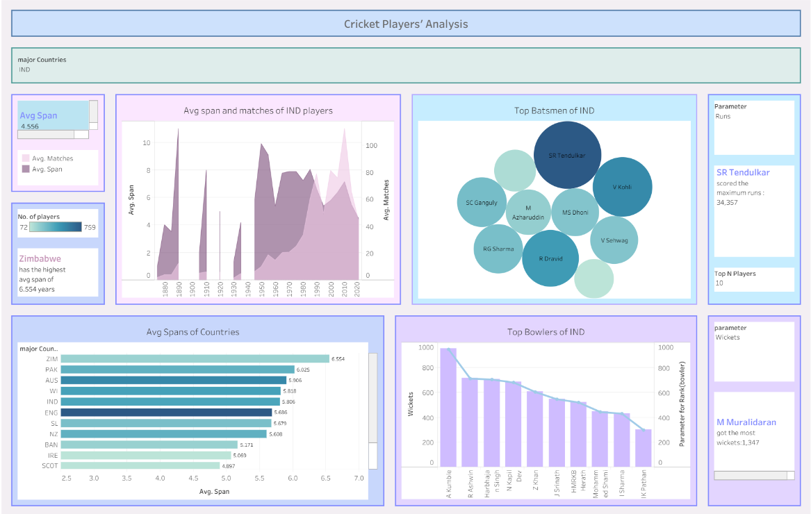

# 🏏 Cricinfo Players' EDA Project

## 📌 Project Overview
This project focuses on analyzing cricket players’ careers by scraping data from Cricinfo. It includes **extensive data cleaning**, **exploratory data analysis (EDA)**, and **visualizations** of players’ spans and all-rounder performances.  
An **interactive Tableau dashboard** complements the static analysis for deeper insights.

---

## ⚙️ Workflow

1. **Web Scraping**
   - Scraped data from ~137 Cricinfo pages using Python.  
   - Extracted player details including span, role, and performance metrics.

2. **Data Cleaning & Preparation**
   - Handled missing/inconsistent values using **Excel** and **Google Colab (Python)**.  
   - Standardized column formats and merged multiple datasets.  

3. **Exploratory Data Analysis (EDA)**
   - Analyzed **players’ playing spans** across countries.  
   - Studied **all-rounder statistics** and performance distribution by nation.  

4. **Visualization**
   - Created plots in **Matplotlib** for initial analysis.  
   - Designed an **interactive and dynamic dashboard in Tableau Public**.  

---

## 🛠️ Tools & Technologies

- **Python** (BeautifulSoup, Pandas, NumPy, Matplotlib)  
- **Excel** (initial cleaning and validation)  
- **Google Colab** (data preprocessing & analysis)  
- **Tableau Public** (interactive dashboard)  

---

## 📈 Interactive Dashboard

👉 Click the image below to explore the **Tableau Dashboard**:  

)

---

## 🚀 Key Insights
- Identified countries with the **longest average playing spans**.  
- Compared **all-rounder contributions** across nations.  
- Built an **interactive tool** for dynamic filtering of player roles, countries, and spans.  
